# YoPt

A Kotlin Multiplatform LLM chat client that sends prompts to multiple providers from a single
interface. Targets Android, Desktop (JVM), iOS, macOS, and Web (JS).

## Build & Run

### Desktop (JVM)
```bash
./gradlew :composeApp:run          # run directly
./gradlew :composeApp:desktopJar   # → composeApp/build/libs/composeApp-desktop.jar
```

### Android
```bash
./gradlew :androidApp:assembleDebug    # → androidApp/build/outputs/apk/debug/androidApp-debug.apk
./gradlew :androidApp:assembleRelease  # → androidApp/build/outputs/apk/release/androidApp-release-unsigned.apk
```
Requires Android SDK.

### macOS

Two build paths — Gradle (fast CLI) and Xcode (debugging, distribution).

**Gradle (CLI only, no Xcode needed)**

| Command | Output |
|---------|--------|
| `./gradlew :composeApp:runMacosNative` | Debug `.app`, runs immediately |
| `./gradlew :composeApp:packageMacosApp` | Release `.app` at `composeApp/build/macos/YoPt.app` |

First launch: right-click → Open to bypass Gatekeeper (unsigned).

**Xcode (debugger, Instruments, signing)**

Build the XCFramework first — Xcode validates file references before running the
"KMP Build" script phase, so the framework must exist on disk before `xcodebuild`:

```bash
# Step 1: Build the KMP XCFramework (always debug — the Xcode project hardcodes this path)
./gradlew :composeApp:assembleComposeAppDebugXCFramework

# Step 2: Build the KMP framework + macOS app
xcodebuild -project xcodeApp/YoPt.xcodeproj -scheme "YoPt macOS" -configuration Debug build
#   → DerivedData/.../Build/Products/Debug/YoPt macOS.app

# Clean build
xcodebuild -project xcodeApp/YoPt.xcodeproj -scheme "YoPt macOS" -configuration Debug clean build

# Release build
xcodebuild -project xcodeApp/YoPt.xcodeproj -scheme "YoPt macOS" -configuration Release build
```

Or open `xcodeApp/YoPt.xcodeproj` → `YoPt macOS` scheme → Run (⌘R).

Gradle path is smaller (~38 MB, K/N only) and faster to iterate. Xcode path is larger
(~179 MB, links Swift + K/N) but supports lldb, Instruments, and code signing.

See `.claude/skills/kmp-xcode.md` for setup details (window pattern, Compose Resources copy phase).

### iOS (Xcode)

```bash
# Build the KMP XCFramework (all platforms)
./gradlew :composeApp:assembleComposeAppDebugXCFramework
#   → composeApp/build/XCFrameworks/debug/ComposeApp.xcframework
```

Then open `xcodeApp/YoPt.xcodeproj` → `YoPt iOS` scheme → Run (⌘R).

Or build from CLI:
```bash
xcodebuild -project xcodeApp/YoPt.xcodeproj -scheme "YoPt iOS" -configuration Debug build
```

### Web (Wasm/JS)
```bash
./gradlew :composeApp:wasmJsBrowserDevelopmentRun  # dev server at http://localhost:8080
./gradlew :composeApp:wasmJsBrowserDistribution    # → composeApp/build/dist/wasmJs/productionExecutable/
```

Requires JDK 11+.

## Test

### Desktop (JVM) — fastest local feedback
```bash
./gradlew :shared:desktopTest :composeApp:desktopTest
```

### macOS native
```bash
./gradlew :shared:macosArm64Test :composeApp:macosArm64Test
```

### Quick sanity (lint + ABI + tests)
```bash
./gradlew :shared:check :composeApp:check
```

### All targets (slower)
```bash
./gradlew :shared:allTests :composeApp:allTests
```

## Supported Providers

- **OpenAI API style** — OpenRouter, DeepSeek
- **Google Gemini** — Gemini

Models are fetched dynamically from each provider's API — no hardcoded model list. Configure an API key, hit Refresh, and the available models appear. You can enable/disable any of them in settings.

## How It Works

The chat interface is centered around a **chat name** field. Type any name in the field — if it
matches an existing chat, it picks up where you left off. If it's a new name, a new chat is created
automatically when you hit Send. Each chat keeps its own instruction prompt and full conversation
history, all persisted across sessions.

History is embedded in the chat object itself — no separate database for responses. This keeps
things straightforward at this scale, with the option to introduce lazy-loading later if
conversations grow long.

## Architecture

### Two modules

| Module        | What's in it                                                                                                    |
|---------------|-----------------------------------------------------------------------------------------------------------------|
| `shared/`     | Models, repository interfaces (ports), use cases, and infrastructure implementations (HTTP client, persistence) |
| `composeApp/` | Compose Multiplatform UI — screens, dialogs, platform entry points                                              |

### Domain layer

The domain layer in `shared/` owns the models and repository contracts. The key models:

- **Chat** — identified by its title (the chat name). Carries instructions, an optional default
  model, and a list of `ResponseEntry`.
- **ResponseEntry** — a single prompt-response pair with a timestamp and model info. Lives inside a
  Chat's history list.

Repository interfaces use `suspend` functions and `Flow` — standard Kotlin coroutines. On iOS, SKIE
auto-generates Swift `async` wrappers so the same shared code is callable from Swift without manual
bridging.

### Why not "pure" domain?

An effectless domain (no suspend, no ports, only pure functions) would require duplicating every use
case in Kotlin and Swift. For this app the pure logic amounts to data transformations like
`chat.copy(history = history + entry)`. The duplication cost outweighs the abstraction benefit, so
the shared Kotlin code owns both the contracts and the orchestration.

### UI state

The UI layer in `composeApp/` uses `remember { mutableStateOf(...) }` directly in composables — no
ViewModel pattern. Async work goes through `rememberCoroutineScope()`.

Persisted state (selected model, chats) is driven by reactive `Flow` from the use cases. The UI
subscribes with `collectAsState()` — no `LaunchedEffect` needed to load or sync values. Writing
through a use case automatically propagates the change to all collectors.

```kotlin
val selectedModel by modelSelectionUseCase.observe().collectAsState(null)
scope.launch { modelSelectionUseCase.set(m.id) }  // flow propagates, UI updates
```

## UML

```mermaid
classDiagram
    direction TB

    %% ── Models ─────────────────────────────────────────────
    namespace model {
        class Chat {
            +String id
            +String title
            +String instructions
            +String? defaultModelId
            +List~ResponseEntry~ history
        }
        class ResponseEntry {
            +Long timestamp
            +String prompt
            +String response
            +String modelId
            +String modelName
        }
        class ModelDef {
            +String id
            +String providerId
            +String officialName
        }
        class ProviderDef {
            +String id
            +String name
            +ApiStyle apiStyle
            +AuthType authType
            +String baseUrl
        }
        class AuthCredentials {
            +String providerId
            +String? apiKey
            +String? accessToken
            +String? refreshToken
            +Long? expiresAt
        }
        class AuthType {
            <<enumeration>>
            ApiKey
            OAuth
        }
        class ApiStyle {
            <<enumeration>>
            OPENAI
            ANTHROPIC
            GEMINI
        }
    }

    %% ── Ports ──────────────────────────────────────────────
    namespace port {
        class ChatRepository {
            <<interface>>
            +observeAll() Flow~List~Chat~~
            +findByName(String) Chat?
            +create(String, String) Chat
            +appendHistory(String, ResponseEntry)
            +update(Chat)
            +delete(String)
        }
        class ModelRepository {
            <<interface>>
            +getProviders() List~ProviderDef~
            +getAllModels() List~ModelDef~
            +observeModels() Flow~List~ModelDef~~
            +upsertModels(String, List~ModelDef~)
        }
        class LLMRepository {
            <<interface>>
            +send(String, ModelDef, String?, String?) String
        }
        class AuthService {
            +observeCredentials() Flow~List~AuthCredentials~~
            +getCredentials(String) AuthCredentials?
            +saveApiKey(String, String)
            +deleteCredentials(String)
            +importAll(List~AuthCredentials~)
            +mergeCredentials(List~AuthCredentials~)
        }
        class DisabledModelsRepository {
            <<interface>>
            +observe() Flow~Set~String~~
            +setDisabled(String, Boolean)
        }
        class ModelSelectionRepository {
            <<interface>>
            +observe() Flow~String?~
            +set(String)
        }
        class SettingsRepository {
            <<interface>>
            +export() String
            +import(String)
        }
    }

    %% ── Use Cases ──────────────────────────────────────────
    namespace usecase {
        class SendPromptUseCase
        class ManageModelsUseCase
        class ManageChatsUseCase
        class ManageAuthUseCase
        class ManageModelSelectionUseCase
        class RefreshModelsUseCase
        class ExportImportUseCase
    }

    %% ── Infra ──────────────────────────────────────────────
    namespace infra {
        class LLMClient {
            +send(String, String?, String, ProviderDef, String?) String
            +fetchModels(ProviderDef, String?) List~ModelDef~
        }
        class KtorLLMRepository
        class InMemoryChatRepository
        class InMemoryModelRepository
        class AuthService
        class InMemorySettingsRepository
        class PlatformDisabledModelsRepository
        class PlatformModelSelectionRepository
        class KeyValueStore
        class SecureStore
        class OAuthBrowser
        class OAuthClient
        class PredefinedProviders
    }

    %% ── UI ─────────────────────────────────────────────────
    namespace ui {
        class App
        class MainScreen
        class SettingsScreen
    }

    %% ── Relations ──────────────────────────────────────────
    Chat *-- ResponseEntry
    Chat --> ModelDef
    ModelDef --> ProviderDef
    ProviderDef --> AuthType
    ProviderDef --> ApiStyle
    AuthCredentials --> ProviderDef

    SendPromptUseCase --> LLMRepository
    SendPromptUseCase --> ManageModelsUseCase
    SendPromptUseCase --> AuthService
    SendPromptUseCase --> ChatRepository

    ManageModelsUseCase --> ModelRepository
    ManageModelsUseCase --> DisabledModelsRepository

    ManageChatsUseCase --> ChatRepository
    ManageAuthUseCase --> AuthService
    ManageModelSelectionUseCase --> ModelSelectionRepository
    ExportImportUseCase --> SettingsRepository
    RefreshModelsUseCase --> ModelRepository
    RefreshModelsUseCase --> LLMClient

    KtorLLMRepository ..|> LLMRepository
    KtorLLMRepository --> LLMClient
    KtorLLMRepository --> ModelRepository

    InMemoryModelRepository ..|> ModelRepository
    InMemoryModelRepository --> KeyValueStore
    InMemoryModelRepository --> PredefinedProviders

    InMemoryChatRepository ..|> ChatRepository
    InMemoryChatRepository --> KeyValueStore

    AuthService --> SecureStore
    OAuthBrowser --> OAuthClient

    InMemorySettingsRepository ..|> SettingsRepository
    InMemorySettingsRepository --> ModelRepository
    InMemorySettingsRepository --> ChatRepository
    InMemorySettingsRepository --> AuthService

    PlatformDisabledModelsRepository ..|> DisabledModelsRepository
    PlatformModelSelectionRepository ..|> ModelSelectionRepository

    App --> MainScreen
    MainScreen --> SendPromptUseCase
    MainScreen --> ManageModelsUseCase
    MainScreen --> ManageChatsUseCase
    MainScreen --> ManageAuthUseCase
    MainScreen --> RefreshModelsUseCase
    MainScreen --> ManageModelSelectionUseCase
    MainScreen --> ExportImportUseCase
    MainScreen --> SettingsScreen
    SettingsScreen --> ManageModelsUseCase
    SettingsScreen --> ManageChatsUseCase
    SettingsScreen --> ManageAuthUseCase
    SettingsScreen --> RefreshModelsUseCase
    SettingsScreen --> ExportImportUseCase
```



## Stack

- **Kotlin Multiplatform** 2.1.10
- **Compose Multiplatform** 1.7.3
- **Ktor** 3.1.2 (HTTP client)
- **kotlinx-serialization** (JSON)
- **kotlinx-coroutines** 1.10.2
- **SKIE** 0.10.2 (Swift interop for suspend functions)

## Known Limitations

### Export format versioning

The `ExportData.v` field (version number) is written to export JSON but never checked on import. If the
export format changes in a future version, importing old-format files may silently deserialize with
missing fields rather than showing a clear upgrade message. Backward-compatible for v1, but should
add a version guard before any breaking format change.

### macOS Keychain

Credentials on macOS/iOS are stored in `NSUserDefaults` (with a `yopt_secure.` prefix), not in the
system Keychain. On macOS, FileVault (enabled by default since 10.13) encrypts the home directory at
rest. On iOS, Data Protection encrypts NSUserDefaults. Full Keychain integration (`SecItemAdd` /
`SecItemCopyMatching`) is blocked by Kotlin/Native CF-interop type mismatches — an ObjC bridging
header would be the simplest workaround.

### macOS native markdown rendering

Markdown responses render as plain monospace `Text` on macOS native. The multiplatform-markdown-renderer
library does not ship a macOS artifact. Desktop JVM uses the same library via JVM classpath.
